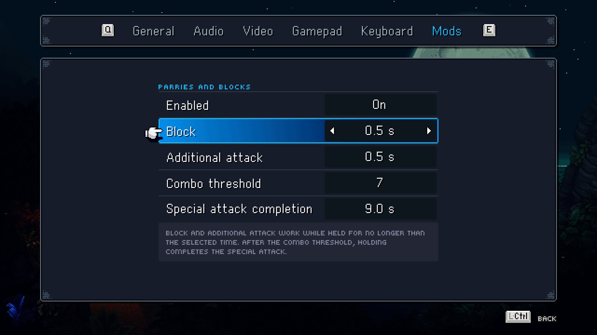
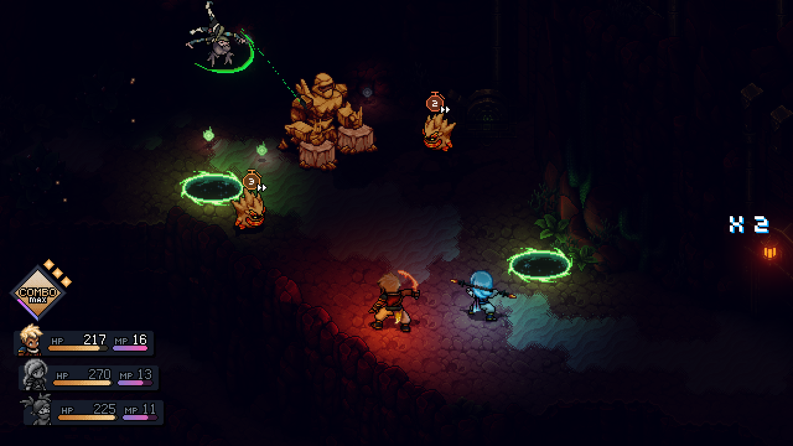
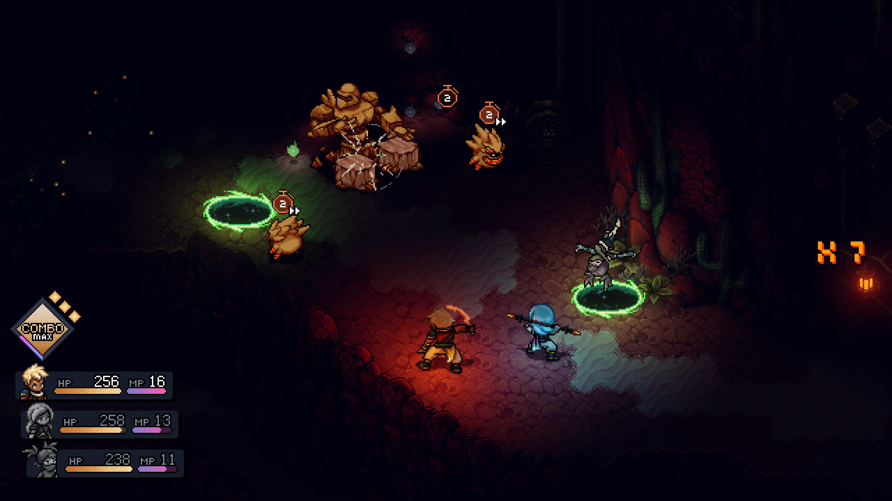
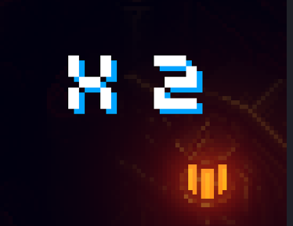
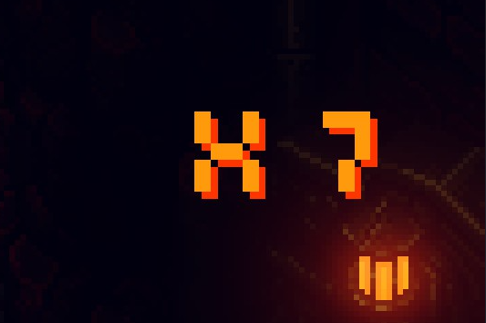

# Sea of Stars Improved Parries and Blocks

Sea of Stars Improved Parries and Blocks adds configurable bounded hold assistance for timed blocks, timed bonus attacks, and repeating timed-input special attacks in the Windows version of Sea of Stars.

## Features

- Configurable block hold duration
- Configurable bonus-attack hold duration
- Combo threshold for repeating special attacks
- Extended special-attack completion hold after reaching the threshold
- Native-styled Mods tab in the Options screen
- Localized settings for every language supported by the game
- Battle counter that stops visually at the configured threshold and pulses when extended hold is available
- Coverage for Moonrang, Soonrang, Limbo, Arcane Barrage, Resh'an's multi-flask attack, Venom Flurry, Leap Frog, Trapeze, and Jugglenaut

## Screenshots

### In-game settings

### Battle counter

| Building the combo | Extended hold available |
| --- | --- |
|  |  |

## Requirements

- Sea of Stars for Windows
- BepInEx 6 for IL2CPP, including generated interop assemblies
- .NET 6 SDK for source builds
- .NET Framework 4 compiler for the Windows Forms installer

## Install a release

Keep `ParriesAndBlocksInstaller.exe` and the matching `.pbpkg` file in the same folder, then run the installer. It detects Steam libraries or accepts a manually selected folder containing `SeaOfStars.exe`.

The installer writes only to `BepInEx/plugins/GenerousBlock`. It does not bundle BepInEx, game files, or any other mod. Removing the mod preserves its BepInEx configuration file.

For Nexus Mods, use the dedicated manual-install ZIP. It contains no executable and no nested archive.

## Build from source

See [Building](docs/BUILDING.md). The repository intentionally excludes game binaries, generated interop assemblies, build output, and release payloads.

## How it works

The plug-in feeds the game's existing timed-input checks only while a configured hold window is active. It does not extend the game's QTE deadlines or animation durations. The visual combo counter is independent of the game's native counters.

## Repository policy

Project documentation, comments, identifiers, logs, and build output are written in English. Runtime localization strings use Unicode escapes where required.

## License

The project may be used, inspected, forked, and modified solely for personal, non-commercial purposes. Commercial use, sale, monetization, repackaging, and inclusion in third-party mod packs or software bundles are prohibited. See [LICENSE](LICENSE) for the complete terms. Sea of Stars and all game materials remain the property of their respective rights holders.
